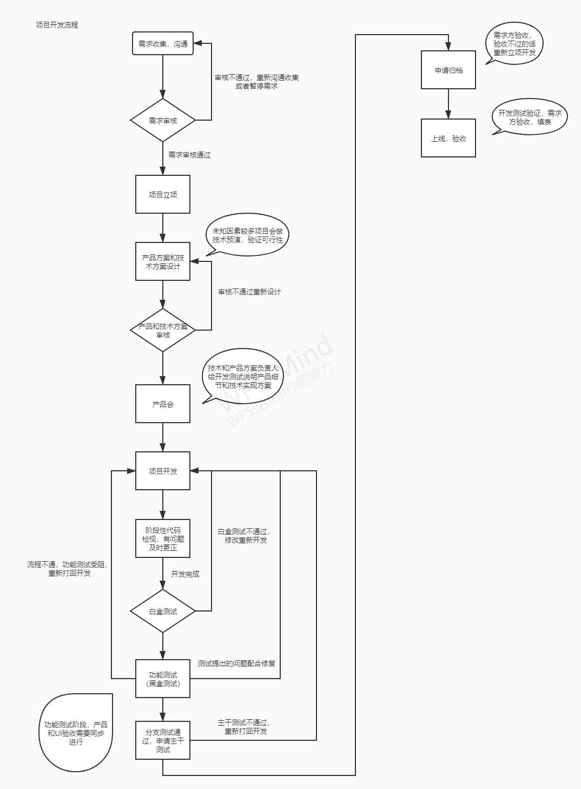

### 入职第一天

#### 熟悉团队成员

+ 参加早上站立会，熟悉早会流程和内容
+ 分配开发小组
+ 介绍日后工作内容和方向
+ 熟悉日常项目开发流程

+ [了解团队代码管理规范](http://test.lcsw.cn:8196/kod/index.php?share/file&user=1&sid=rsbpfkWm)

### 新手任务阶段

+ 第一周是新手任务阶段，要求一周时间完成新手任务，限定技术栈为`vue/angular`
+ 第二周开始下周合作商接口对接工作，并且开始阅读熟悉所在小组相关项目代码
+ 第三周开始日常项目开发

