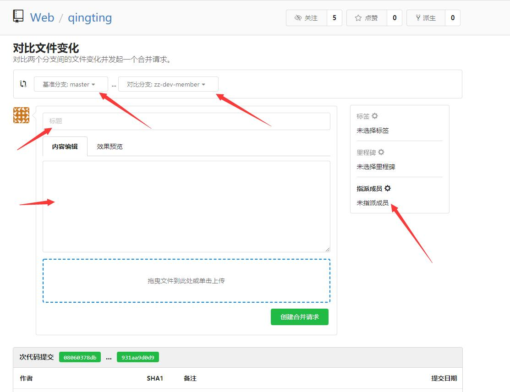

### 为了便于团队项目能够更好的协同开发和维护，现制定以下git使用规范

#### 分支模型

+ `master` - 最为稳定功能最为完整的随时可发布的代码;
+ `dev` - 永远是功能最新最全的分支;
+ `feature-[项目名称]` - 特性分支，某个功能点正在开发阶段的分支；
+ `hotfix-[问题名称|bug编号]` - 修复线上代码的 bug的分支；

##### master 主分支
    > master主分支始终保持稳定的可发布版本
    > 只有项目组主程才拥有master主分支的管理权限（例如其他分支合并到master必须由主程操作）

##### dev 开发分支
    > dev开发分支为不稳定版本，可能存在功能缺失，但已有的功能必须是完整的
    > 原则上不允许直接在dev分支上进行功能开发，必须新建feature分支进行开发
    > dev分支是跑在测试环境的代码，给测试同学测试的

##### feature-[功能名称] 功能开发分支
    > 从master主干创建，横线后跟功能名称，用于新功能开发，每天下班前push提交到远程
    > 开发完成之后切回dev分支，拉取最新dev上最新代码，把feature分支合并到dev分支，这里会有冲突文件，需要对应项目的同事一起来合并冲突

##### hotfix-[问题名称 | bug编号] 紧急热修复分支
    > 从master分支创建，横线后面跟上问题名称或者对应的bug编号，仅仅适用于**生产线问题紧急修复**！！！
    > 修复完成，测试通过，合并到master和dev分支上，然后将此分支删除


#### commit规范

##### 日志规范
+ 功能点，列1，2，3
+ 【研发：xx 测试：xx 项目经理：xxx】

##### 提交频率
+ 每天下班前必须提交feature分支，并且push到远程【防止出现电脑挂掉导致代码遗失的问题】
+ hotfix、feature分支尽量按照功能点或修复重构的问题及时commit（不要求push）【目的是防止一次commit提交大量改动，不便于后期排错】


#### 开发流程
+ 1. 开发者pull master最新代码，拉取feature分支 统一命名风格：feature-[项目名称]
+ 2. 在feature分支上完成开发自测后，切换到dev分支，pull最新代码，把feature分支合并到dev分支，可能会出现冲突，和协作同事商量解决。

> 注意，非简单的解决featue a 和test分支冲突，需要商量是feature a还是feature b需要调整代码，假若feature a需要调整代码，feature a调整代码，合并到dev分支。feature b 重新操作合并到dev分支。
+ 3. 通知测试在测试分支测试，这个阶段不用关心发版进程，除非业务互相依赖。bug也在feature分支修改，修复完成后合并流程参考step2;
+ 4. 测试完全通过后，开发切换到master分支，pull最新代码，切换回feature分支，把master分支合并到feature分支（保证即将发布的代码没冲突），在gitlab提交合并请求，写上功能需求点，脚本等，指定项目管理员审核并且合并代码
+ 5. 管理员审核代码，处理（本次版本内）合并请求，打tag，发版，走线上验证流程。
+ 6. 完成功能开发。feature可以保留几周后统一清理


#### 合并不同分支代码

+ 保持commit记录清爽，比如上面的step2 ,把feature分支合并到dev分支，feature分支里面有很多每日的提交commit记录，这些记录只允许存在这个feature分支，不能合并到dev分支里面来

`正确做法`
```
git merge --squash feature-a  
git commit -m "合并feature-a分支代码到dev分支【研发：xxx 测试：xx 项目经理：xxx】"
```

`错误做法`(这样会把feature分支上的提交记录都混过来，导致commit记录混乱，不方便回滚代码)
```
git merge feature-a 
```


#### git 提交合并请求，审核代码流程





